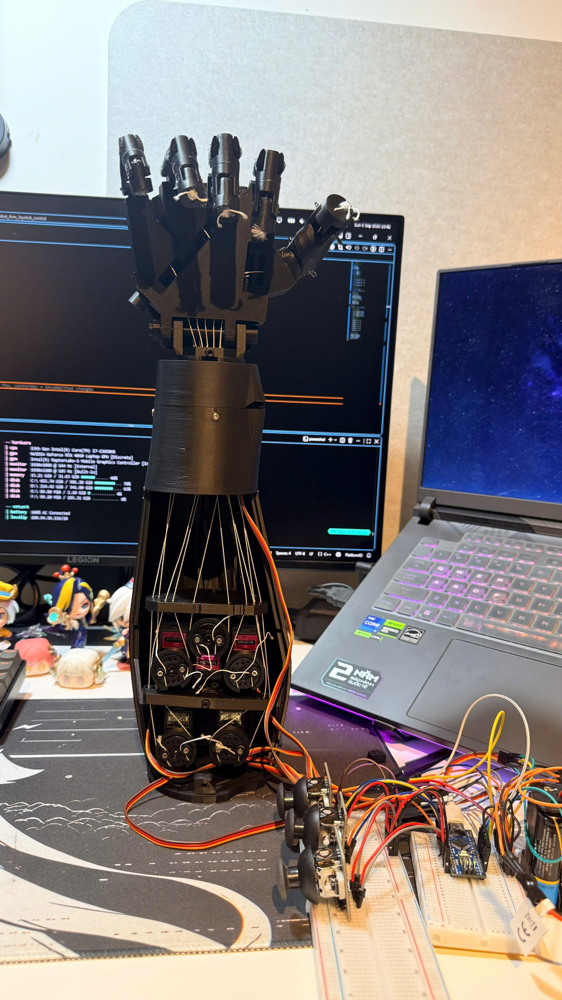

# 🦾 Joystick Controlled Robotic Hand


A joystick controlled 3D printed robotic hand and forearm using six servo motors for independent finger and wrist movement.

The system uses three two-axis analog joysticks to control five fingers and one wrist axis through an Arduino Nano.

# Note

This project builds on concepts from my previous **Joystick Servo Control** project:

https://github.com/Oleme2708/joystick_servo_control

The previous project used two joysticks to control multiple servo motors.

This project expands the same idea into a tendon driven robotic hand with:

- 3 analog joysticks
- 6 servo motors
- 5 independently controlled fingers
- 1 wrist movement
- Arduino Nano control

The mechanical hand and forearm are based on the open-source **InMoov robotic hand** design.

# Demo



[](demo_vid/Demo_1.mp4)

[](demo_vid/Demo_2.mp4)

# Project Overview

This project is a 3D printed robotic hand controlled using an Arduino Nano.

Each finger is connected to a servo motor through fishing line acting as a tendon. When the servo rotates, the tendon is pulled and the finger bends.

Five servo motors control the fingers:

```text
Thumb
Index finger
Middle finger
Ring finger
Little finger
```

A sixth servo controls the wrist.

Three two-axis analog joysticks provide six analog inputs, allowing all six actuators to be controlled independently.

```text
3 × Analog Joysticks
        |
        | 6 analog signals
        v
   Arduino Nano
        |
        | Servo control signals
        v
   6 Servo Motors
        |
        +---- Thumb
        +---- Index
        +---- Middle
        +---- Ring
        +---- Little
        +---- Wrist
```

# Features

- Five independently controlled fingers
- Servo controlled wrist
- Three two-axis analog joysticks
- Six servo motors
- Direct joystick to servo position control
- Tendon driven finger actuation
- Arduino Nano controller
- PlatformIO development

# Hardware

- Arduino Nano
- 6 × servo motors
- 3 × two-axis analog joysticks
- External servo power supply
- 3D-printed InMoov hand and forearm
- Fishing line
- Jumper wires
- Breadboard
- USB cable
- Screws / mechanical fasteners

# Software

- Visual Studio Code
- PlatformIO
- Arduino framework

# Libraries

```cpp
#include <Arduino.h>
#include <Servo.h>
```

# Pin Configuration

## Wiring Diagram


## Joysticks

```text
Joystick 1 X ---> A0 ---> Thumb
Joystick 1 Y ---> A1 ---> Index

Joystick 2 X ---> A2 ---> Middle
Joystick 2 Y ---> A3 ---> Ring

Joystick 3 X ---> A4 ---> Little
Joystick 3 Y ---> A5 ---> Wrist
```

## Servos

```text
D2 ---> Wrist
D3 ---> Thumb
D4 ---> Index
D5 ---> Middle
D6 ---> Ring
D7 ---> Little
```

# Control Logic

The project uses direct joystick-to-servo position mapping.

Each joystick axis produces an analog value from approximately `0` to `1023`. This value is mapped directly to a servo angle from `0°` to `180°`.

```cpp
int servoAngle = map(joystickValue, 0, 1023, 0, 180);
servo.write(servoAngle);
```

The servo therefore follows the physical position of the joystick.

```text
Joystick moved upward   ---> finger closes
Joystick moved downward ---> finger opens
Joystick at centre      ---> servo moves to approximately 90°
```

# Tendon Setup

Each finger uses fishing line as a tendon connected to a servo horn.

The tendon length and tension were adjusted manually so that the fingers could open and close without excessive tension or mechanical binding.

Too much tendon tension can cause the servo to stall or the finger mechanism to become stuck.


# How to Use

1. Connect the three joysticks to `A0`–`A5`.
2. Connect the six servo signal wires to `D2`–`D7`.
3. Power the servos from an external supply.
4. Connect the external supply ground to Arduino GND.
5. Open the project in Visual Studio Code with PlatformIO.
6. Build and upload the firmware to the Arduino Nano.
7. Move each joystick axis to control the corresponding finger or wrist.

# What I Learned

- How to control six servo motors using an Arduino Nano
- How to read six analog joystick inputs
- How to map joystick values to servo angles
- How tendon tension affects robotic finger movement
- How servo position and tendon length interact
- How to power multiple servos using an external supply
- How to troubleshoot servo and joystick wiring
- How to integrate mechanical, electrical and software components

# Errors and Lessons Learned

- **Upload failed with the wrong board configuration:** PlatformIO initially used an Arduino Uno environment instead of the Arduino Nano.
- **Servo and joystick wiring required troubleshooting:** testing the inputs and outputs separately made wiring problems easier to identify.
- **Joystick power wiring needed correction:** the joysticks were powered from the Arduino 5V supply while the servos used the external supply.
- **A common ground is required:** the Arduino and external servo power supply must share the same ground reference.
- **Tendon position affected finger movement:** the tendon attachment position and tension had to be adjusted so the fingers could move without binding.
- **Multiple servos require an external power source:** the Arduino 5V pin is not used to power all six servos.

# Current Limitations

- No finger position feedback
- Direct joystick mapping returns the servo toward approximately 90° when the joystick is released
- Tendon tension requires manual adjustment
- Manual joystick control only

# Future Improvements

- Add preset hand gestures
- Improve tendon tensioning and cable management
- Add finger position or force feedback
- Add EMG control
- Add wireless control

# Credits

The mechanical hand and forearm design are based on the open-source **InMoov** robotic hand project:

https://inmoov.fr/

# Related Project

**Joystick Servo Control**

https://github.com/Oleme2708/joystick_servo_control

This earlier project demonstrated basic joystick and servo control and provided the starting point for this robotic hand project.
